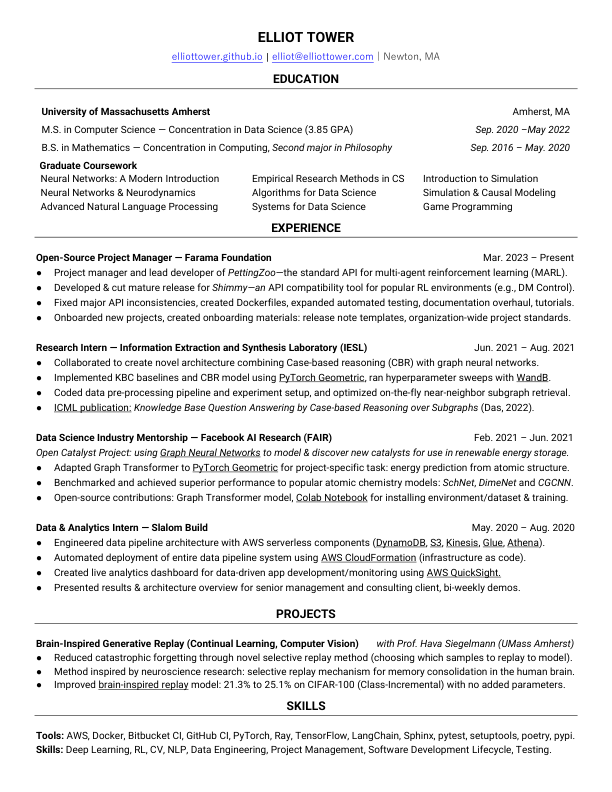

# [elliottower.github.io](https://github.com/elliottower/elliottower.github.io)

### Hi there 👋

I'm Elliot. I enjoy creating tools for machine learning research, particularly Reinforcement Learning. 

🚀 I'm currently working on training RL agents for two of my favorite board games: [gobblet-rl](https://github.com/elliottower/gobblet-rl) and [cathedral-rl](https://github.com/elliottower/cathedral-rl). 

💥 A live version of Gobblet running in the browser can be viewed [here](https://elliottower.github.io/gobblet-rl/) (uses WebAssembly to run Python code in a virtual machine, see [tutorial](https://github.com/elliottower/gobblet-rl/blob/main/tutorials/WebAssembly/web_assembly.md) for details)


## 📫 How to reach me:

 [](mailto:elliot@elliottower.com)
 [](https://www.linkedin.com/in/elliot-tower)
 [](https://github.com/elliottower/)
 

## ⚡ [Recent Activity (GitHub)](https://github.com/elliottower)

<!--START_SECTION:activity-->
1. 🗣 Commented on [#5878](https://github.com/Unity-Technologies/ml-agents/issues/5878) in [Unity-Technologies/ml-agents](https://github.com/Unity-Technologies/ml-agents)
2. 🗣 Commented on [#899](https://github.com/Farama-Foundation/PettingZoo/issues/899) in [Farama-Foundation/PettingZoo](https://github.com/Farama-Foundation/PettingZoo)
3. 💪 Opened PR [#903](https://github.com/Farama-Foundation/PettingZoo/pull/903) in [Farama-Foundation/PettingZoo](https://github.com/Farama-Foundation/PettingZoo)
4. 🗣 Commented on [#863](https://github.com/Farama-Foundation/PettingZoo/issues/863) in [Farama-Foundation/PettingZoo](https://github.com/Farama-Foundation/PettingZoo)
5. 🗣 Commented on [#877](https://github.com/Farama-Foundation/PettingZoo/issues/877) in [Farama-Foundation/PettingZoo](https://github.com/Farama-Foundation/PettingZoo)
6. 🗣 Commented on [#888](https://github.com/Farama-Foundation/PettingZoo/issues/888) in [Farama-Foundation/PettingZoo](https://github.com/Farama-Foundation/PettingZoo)
7. 🗣 Commented on [#895](https://github.com/Farama-Foundation/PettingZoo/issues/895) in [Farama-Foundation/PettingZoo](https://github.com/Farama-Foundation/PettingZoo)
8. 🗣 Commented on [#896](https://github.com/Farama-Foundation/PettingZoo/issues/896) in [Farama-Foundation/PettingZoo](https://github.com/Farama-Foundation/PettingZoo)
9. 🗣 Commented on [#901](https://github.com/Farama-Foundation/PettingZoo/issues/901) in [Farama-Foundation/PettingZoo](https://github.com/Farama-Foundation/PettingZoo)
10. 🗣 Commented on [#313](https://github.com/Farama-Foundation/Minigrid/issues/313) in [Farama-Foundation/Minigrid](https://github.com/Farama-Foundation/Minigrid)
<!--END_SECTION:activity-->


## 🖥️ [Weekly development breakdown](https://wakatime.com/@elliottower)
<!--START_SECTION:waka-->

```text
Python           2 hrs 31 mins   ██████████▒░░░░░░░░░░░░░░   41.89 %
Markdown         1 hr 12 mins    █████░░░░░░░░░░░░░░░░░░░░   20.23 %
Other            1 hr 12 mins    █████░░░░░░░░░░░░░░░░░░░░   20.20 %
```

<!--END_SECTION:waka-->


## 📄 [Resume](https://elliottower.github.io/src/pdf/resume.pdf)

<!-- PDF-TO-MARKDOWN:START -->

---
<!-- PDF-TO-MARKDOWN:END -->
